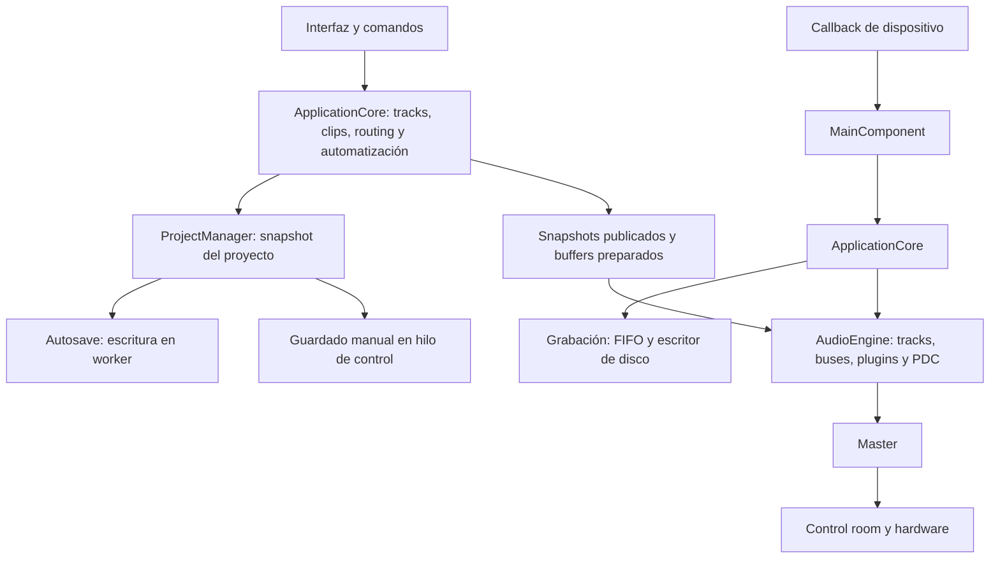

# Auditoría del proyecto Apex y referencia para continuar el desarrollo

**Fecha:** 3 de octubre de 2026 · **Estado:** auditoría de estructura, implementación y evidencia; validación global pendiente.

**Carpeta oficial:** `C:\Users\1993v\OneDrive\Desktop\Apex backup`.

Apex contiene una aplicación de audio activa, un sistema propio de proyectos, automatización, plugins nativos/VST3, aislamiento de plugins, grabación, mezcla, MIDI, patrones, edición y exportación. Hay protecciones de guardado y de vida del motor que deben conservarse. La documentación anterior estaba fragmentada y varios registros de julio ya no describían el estado actual.

El trabajo inmediato debe centrarse en demostrar y cerrar las brechas de persistencia, reparar la cadena de evidencia de pruebas y verificar los cambios durante reproducción. La corrección reciente de volumen está comprobada en escenarios enfocados; todavía falta validarla con una sesión real y completar las puertas generales.

## 1. Alcance y fuerza de las conclusiones

Se inventariaron **172,609 archivos** antes de añadir esta documentación, incluidos archivos ocultos e ignorados, excluyendo los interiores de `.git` y sin seguir enlaces hacia otras copias. Se examinó en detalle el código activo, el guardado/carga/autosave/recovery, las fronteras de audio y plugins, las correcciones locales, los scripts de construcción y los resultados existentes. No se leyó línea por línea cada archivo del SDK, cada compilación ni cada archivo duplicado.

`New folder` contiene otra estructura de Apex: únicamente se inventariaron sus nombres de archivos; su implementación no se utilizó. No se abrieron ni guardaron canciones del usuario. En esta auditoría se actualizaron documentos y se preservó evidencia; no se hicieron nuevas correcciones al código de audio ni nuevas compilaciones.

Las conclusiones distinguen:

- **Observado:** un archivo, un resultado o un comportamiento registrado y comprobado.
- **Riesgo de código:** un camino encontrado mediante lectura que requiere una reproducción dinámica específica.
- **Recomendación:** trabajo propuesto; no se presenta como cambio implementado.

Los anexos contienen rutas, símbolos y líneas exactas: [arquitectura](docs/apex-audit/architecture.md), [persistencia](docs/apex-audit/persistence.md) y [calidad y correcciones](docs/apex-audit/quality.md).

Las referencias `Source/`, `Tests/`, `Scripts/` y `Builds/` se resuelven dentro de `My DAW/DAW_Core`; los registros `APEX_*` y este informe viven en la raíz. Las discrepancias documentales de los anexos describen el estado anterior a la actualización realizada al finalizar esta auditoría.

## 2. Identidad del estado examinado

| Campo | Valor comprobado |
| --- | --- |
| Repositorio exterior | Raíz de `Apex backup`; HEAD `9538337efb49155a37ec47a2af30ee5cc4dfb70f` |
| Repositorio de aplicación | `My DAW/DAW_Core`; HEAD `000816f2d1338d5e97728fdacb72c75e0fe9c24a` |
| Rama de aplicación | `feature/apex-windows-baseline-evidence` |
| Cambios de implementación previos a la auditoría | 10 archivos de la corrección de plugins y del runner; 483 líneas añadidas y 13 retiradas |
| Framework / plataforma | JUCE, Projucer → Visual Studio 2026, Windows x64 |
| Lenguaje efectivo | C++17 en los proyectos Visual Studio de aplicación y tests; el antiguo C++20 del registro era incorrecto para estos flags |
| Brain canónico | `DAW_BRAIN.md` en raíz; SHA-256 `ce92abd24f6ed246004047a374cbf791dedc8fe5b2c2ee98d7154cfa6bc9a7ca` |
| Estado global | Builds actuales y pruebas enfocadas comprobadas; dependencias y batería completa sin aprobación global |

La raíz y el core tienen historiales Git diferentes. HEAD más `dirty=true` no identifica por sí solo la versión compilada. Se preservó el parche de la corrección con su hash, resultados y logs en [evidence](docs/apex-audit/evidence/); no se creó un commit ni se publicó a GitHub.

## 3. Qué contiene la carpeta y qué se compila

| Área | Contenido / tratamiento |
| --- | --- |
| `My DAW/DAW_Core/Source` | 901 archivos físicos en 104 directorios inmediatos, incluyendo recursos y terceros. Principal implementación. |
| `Builds/VisualStudio2026/ArrangementEditor` | **Fuente activa:** 157 archivos listados en Projucer y 37 unidades `.cpp` compiladas. No eliminar junto con builds. |
| `DAW_Core.jucer` | Lista 447 archivos: 290 bajo Source y 157 del editor. Ninguno de esos archivos listados falta. Los headers incluidos indirectamente y dependencias no se limitan a esa lista. |
| `Tests` | Runner, pruebas de subsistemas, fixtures VST3, plugins de prueba y artefactos. Las pruebas locales de un modelo no garantizan un flujo completo de canción. |
| `Scripts`, `Dependencies`, `docs` | Construcción, materialización/verificación de dependencias, validación de evidencia, guías e informes. |
| `My DAW/Sdk setups`, `Source/ThirdParty`, `JuceLibraryCode` | SDK, terceros y material generado. El contrato fija versiones/parches; no modificar una dependencia para eludir su verificador. |
| `tracktion_engine-develop`, `stftPitchShift-main`, paquetes `files (...)`, `trimm...` | Terceros/propuestas/material auxiliar. Estar en la carpeta no demuestra integración en el ejecutable. |
| `Apex plug-ins/Windows` | Bundle externo G10 y un archivo histórico. Diferente del G10 nativo interno creado por Apex. |
| `DAW_BRAIN.md`, `Daw Brain`, `.apex_brain_backups` | Referencia canónica, paquetes y antecedentes. El Brain describe arquitectura; no certifica capacidades actuales. |
| `APEX_*`, `docs/agent-context`, `docs/superpowers`, `recaps` | Estado, historial, handoffs y decisiones. Distinguir fecha/commit y consultar la evidencia actual. |
| `evidence`, `.apex-debug`, `crash-reports` | Resultados, registros y volcados. La evidencia de un fallo debe conservarse antes de una limpieza. |
| `DesignReferences`, recursos visuales y prototipos | Diseño, imágenes, cursores, HTML/CSS/JS. No asumir que un prototipo visible es interfaz integrada. |
| `.opencode`, `.claude`, `.superpowers`, `Cerebro` | Configuración y contexto de asistentes. Sus resúmenes se contrastan con implementación y pruebas. |
| `New folder` | 47,595 archivos de material duplicado, examinados solo como inventario de nombres. No es la copia autorizada para desarrollar. |

El inventario físico registró 121,114 archivos en `My DAW`, 31,012 bajo core `Builds`, 19,076 en `.apex-debug` y 3,844 en core `evidence`. Son conteos de nombres, no medidas de bytes descargados u ocupación física de OneDrive.

Consultar [resumen por carpeta](docs/apex-audit/folder-summary.csv), [manifest del proyecto](docs/apex-audit/active-source-manifest.json), [módulos Source](docs/apex-audit/source-modules.txt) e [inventario completo comprimido](docs/apex-audit/folder-inventory.zip).

## 4. Cómo funciona el sistema

La interfaz y el hilo de control crean/destruyen plugins, editan el modelo y publican representaciones para el audio. El callback procesa bloques y no debe hacer disco, esperar, construir plugins ni asignar memoria. La grabación usa un escritor de disco separado. El export usa su thread y una barrera que suspende y drena el procesamiento live antes de preparar offline; actualmente **rechaza plugins sandbox activos**.

`ApplicationCore` posee los subsistemas; `AudioEngine::processWithSnapshot` recorre el grafo. `ApexSoundEngineNucleus.h` agrupa helpers, no es el dueño de todo el recorrido. Source contiene scanner en subprocess y runtime sandbox: son dos formas de aislamiento distintas. El formato activo es VST3 junto con `APEX Native` (G10, C4 y Parametric EQ); no se encontró CLAP registrado en el host.

El audio tiene barreras de admisión y drenaje para carga de proyectos, reprepare, shutdown y offline. Conservarlas al corregir bugs; sustituir un puntero sin asegurar la vida del objeto anterior no basta. Evidencia del flujo: `Source/MainComponent.cpp:7527`, `:7485`; `Source/AppCore/ApplicationCore.cpp:1423`, `:1597`, `:1605`, `:1613`; `Source/AudioEngineCore/AudioEngine.h:2023`.

## 5. Cómo se guarda la información de una canción

El documento es **XML `.dawproj`, raíz `DAWProject`, versión 9**. Guarda el estado de la canción y referencias a medios; no es una carpeta portable con todo el audio incorporado. `ProjectManager::buildState` reúne estados de los subsistemas. El manual save agrega algunas propiedades de interfaz que no están en el autosave básico.

| Dato | Qué queda guardado |
| --- | --- |
| Tracks | IDs, nombres, orden/organización, volumen/pan, mute/solo/arm/monitor y otras propiedades. |
| Audio clips | ID y track, ubicación/duración/rangos, ganancias, fades, pitch/stretch y ruta absoluta del archivo. El WAV permanece externo. |
| MIDI clips | Modelo de piano roll y notas, tempo/tasa; embebidos en el XML del proyecto. |
| Automatización | Árbol legacy con tiempos en muestras y árbol APEX con puntos PPQ, keys/IDs y modos. Ambos se guardan. |
| Plugins | Descriptor/identidad, UUID de instancia, orden, bypass/mix, buses/Layout, modo in-process/sandbox y blob de estado en Base64. |
| Routing y buses | Relaciones entre nodos, sends/sidechains, folders y estado de master que el serializer realmente conecta. |
| UI | Zoom/scroll/grid, selección, Bubblegum y vista; collapsed folders se agrega en save manual. |
| Vocal Tune | Estado de edición por clip; análisis/renders derivados se cachean fuera del documento. |
| Click / Quick Tracks | Estado de click y colores de roles. Las plantillas globales usan archivos propios. |
| Step sequencer y patterns | Hay serializer de modelo, pero no está integrado en `ProjectManager` ni en el save augmentation. Persistencia de estos patterns **pendiente de corregir y comprobar**. |

Guardado manual: capturar estado → crear temporal único junto al destino → escribir/cerrar → comprobar parse XML → backup opcional → publicación transaccional → actualizar ruta/dirty únicamente tras éxito. Autosave: snapshot en GUI y XML/I/O en un worker. Captura de estado de plugin fallida rechaza el nuevo documento; no publicar una canción parcial como válida.

Carga: parsear y validar raíz/versión antes de editar el modelo; cerrar admisión del audio; restaurar por etapas; reparar datos legacy; cargar medios; abrir audio solo si restore queda usable. Un restore parcial fallido no reconstruye automáticamente la sesión anterior en memoria, pero mantiene bloqueado su audio/guardado. Las discrepancias de sample rate con metadatos probados se reconcilian conservando tiempo en segundos; PPQ no se escala. Los casos legacy o de tasa desconocida tienen reglas propias.

La publicación transaccional y las pruebas de fallo protegen el archivo anterior. No equivalen a una certificación de resistencia a cualquier corte eléctrico o conflicto de sincronización. El anexo describe exactamente el nivel de validación y las brechas de identidad/revisión.

## 6. Dónde se conserva cada clase de información

`%APPDATA%` aquí es la ubicación que devuelve JUCE en Windows; `%APPDATA%\APEX` y `%APPDATA%\DAW_Core` son dos áreas distintas usadas por la aplicación.

| Ubicación | Uso |
| --- | --- |
| Archivo elegido `*.dawproj` | Canción XML y referencias externas. |
| Junto a canción: `.backups/*.dawproj` | Copias previas del guardado manual; límite 20 por directorio. |
| Junto a canción: `.apex_autosaves/*.apex` | XML de autosave, latest y diez slots históricos por defecto. Intervalo por defecto 120 segundos. |
| `%APPDATA%\APEX\UnsavedProjectAutosaves` | Autosaves de canciones aún sin nombre. |
| `%APPDATA%\APEX\session.lock`, `session.lock.previous` | Última sesión/estado cleanShutdown y ruta para recuperación. |
| `%APPDATA%\DAW_Core\plugin_cache.xml` | Índice de plugins, regenerable por scan; no es el preset de cada canción. |
| `%APPDATA%\DAW_Core\plugin_blacklist.xml`, `plugin_scan_failures.xml` | Seguridad y fallos del scanner. |
| `%APPDATA%\DAW_Core\plugin_window_scales.json`, `recent_projects.txt` | Escalas de ventanas y lista de recientes. |
| `%APPDATA%\APEX\QuickTrackTemplates/*.qttpl` | Plantillas globales de tracks/routing. |
| `%APPDATA%\APEX\Sequences/*.apexseq`, `SeedHistory.dat` | Presets/historial de AutomationSequence. |
| `%APPDATA%\APEX\VocalTuneCache` | Análisis `.apxan` y WAV renders; derivados regenerables. |
| `Recordings` o Documentos `DAW_Core_Projects\Recordings` | WAV de tomas; revisar la conexión de projectDirectory, cuyo caller no se encontró en Source. |

No se comprobó persistencia entre reinicios para todas las preferencias. ShortcutPersistence usa un `PropertySet` en memoria; no se encontró conexión de PropertiesFile para MasterStripFlip ni guardado XML del dispositivo. Estas son brechas que deben probarse, no garantías de que todos los ajustes se restauran.

## 7. Correcciones realizadas y su evidencia

### Corrección de esta sesión: reordenamiento y volumen

Se corrigió la realimentación de valores manuales hacia un historial de suavizado viejo y la asociación de automatización/parámetros al slot anterior. El movimiento conserva las instancias y remapea keys, bindings, lanes y buses; Undo/Redo invierte el movimiento sin recrear plugins. Arrastrar y subir/bajar usan la misma operación.

| Cambio | Fuente |
| --- | --- |
| Mantener valor manual; escribir al parámetro de la instancia correcta | `Source/PluginHostCore/PluginInstanceCore.h:1666`, `:1675` |
| Mover las instancias y proteger la edición | `Source/PluginHostCore/PluginChainCore.h:89`, `:112`, `:1025` |
| Remapear identidad y lanes | `Source/Automation/AutomationParameterKeyCore.h:183`; `Source/AutomationCore/AutomationManagerCore.h:59` |
| Manager vigente y snapshot posterior al movimiento | `Source/AppCore/ApplicationCore.h:208`; `PluginChainCore.h:973` |
| Undo/Redo y panel | `Source/CommandCore/GeneralCommands.h:170`; `MixerPluginSidePanel.h:97`; `Source/MainComponent.cpp:3325` |
| Regresión | `Tests/Source/PluginHost/PluginBusLayoutMatrixTests.cpp:1186` |

Antes: cinco inserts de ganancia producían 0.0125821 donde se esperaba 0.25, aproximadamente **−25.96 dB**, y los valores manuales quedaban en 0.55 en lugar de 1. La ejecución roja tuvo 12 fallos. Después:

| Pruebas enfocadas | Debug | Release |
| --- | --- | --- |
| PluginHost | 417 correctas / 0 fallos | 417 correctas / 0 fallos |
| Mixer fader | 42 correctas / 0 fallos | 42 correctas / 0 fallos |

La nueva regresión aporta 40 comprobaciones dentro de PluginHost: valores manuales, instancias idénticas independientes, identidad/Undo, lanes legacy/wet-dry e instantánea anterior, y 200 movimientos con audio. Ese estrés usa gains unitarios; **no prueba continuidad audible con efectos no unitarios o tails**, ni sustituye la sesión con plugins comerciales.

### Error del programa de pruebas mostrado en la captura

El volcado de `APEXTests.exe` mostró lectura inválida `0xC0000005`; el primer marco Apex fue `MixerStrip::initChildren` (`Source/UICore/MixerPanel.h:2527`). La vida GUI de JUCE terminaba entre suites y eliminaba Theme, mientras un singleton retenía su dirección. `Tests/Source/Main.cpp:93` ahora mantiene esa vida durante todo el proceso. La corrida posterior pasó ese punto y las pruebas enfocadas de fader terminaron en ambas configuraciones.

### Historial que se debe conservar

`APEX_FIX_REGISTRY.md` ya registraba FIX-001…014: calibración y limpieza DSP al cambiar dispositivo, scratch PDC, inicio de transporte, auto-arm seguro, capacidades de dispositivo, drum sampler/MIDI por tasa real, medición LUFS, tiempos del editor, drenaje de auditoría, topology input y reconciliación de sample rate de proyecto. Son entradas históricas; no se reejecutaron todas sus campañas en esta auditoría.

El handoff del 17-septiembre documenta sidechain que envía/recibe desde buses (`a6c6f94`), reparación legacy idempotente, índices/targets de sidechain, Upgrade Project, y corrección de una migración que antes muteaba Sends legítimos (`ccc1f26`). Los commits recientes de septiembre ajustaron los indicadores del mixer y desactivaron Alt+drag gain del arrangement (`2604f9c`, HEAD `000816f`). Un recap viejo no debe restaurar una conducta que un commit posterior corrigió.

### Corrección siguiente: clip numérico y Trim/VU para gain staging (2026-10-03)

El indicador de clip ya no depende del diminuto texto interno del meter. `Track::setPeakLevels` conserva un pico máximo pendiente para el siguiente frame de UI, calcula y mantiene el mayor exceso sobre 0 dBFS, y publica valores seguros si una entrada de canal no es finita. El mixer usa una caja externa de 48×14 con `+x.x dB` y reset por clic tanto para tracks como para Master. El hold visual del medidor ya no puede volver a prender el latch borrado. La atenuación `0.92` por bloque de audio se retiró de los taps del mixer para que el decaimiento no dependa del tamaño del buffer. El gradiente se alinea a dBFS: verde bajo −6, amarillo de −6 a 0 y rojo desde 0; las marcas de color no siguen el taper del fader.

El Trim conserva su finalidad de gain staging antes del fader y antes de los plugins. El VU sigue la misma señal post-Trim/pre-FX que entra al canal: clips, sends entrantes y hardware monitoreado. Cuando un track está armado pero su modo no inserta el micrófono en el buffer, el panel mide una copia del hardware con el target de Trim, sin avanzar el suavizador audible una segunda vez; AudioEngine no pisa ese valor con el buffer de playback. La aguja usa RMS con referencia de 0 VU a −18 dBFS para seno de prueba; el valor Peak Max se muestra aparte como peak real en dBFS. El setter de Trim notifica el cambio del track para que el estado guardado lo recoja.

| Evidencia enfocada | Resultado |
| --- | --- |
| `mixer.clip-input-meter-signal.v1`, Debug x64, 8 casos | 0 fallos; incluye exceso dBFS, reinicio sin relatch visual, geometría de clip box normal/Master, canal válido junto a canal no finito, calibración RMS/VU/peak, +6 dB de Trim→+6 dB VU y micrófono armado sin monitoreo. |
| Aplicación Debug x64 | Build PASS, unsigned; SHA-256 `B98C221BD66954BEB361F5D8EB58D7D0DB6450450C616B01C26F1686877959A9`. |
| Test Debug x64 | Proceso exit 0; SHA-256 `11A1A516E554FB3C28A4D2A2812AFF6611BC0E34A7D5F07BFA915DED927507C5`. Transcript: [clip-input-meter-signal-Debug.txt](docs/apex-audit/evidence/clip-input-meter-signal-Debug.txt). Informe: [clip-vu-meter-verification-Debug.txt](docs/apex-audit/evidence/clip-vu-meter-verification-Debug.txt). |

**Estado:** FOCUSED_VERIFIED en Debug. El patch recuperable está en [clip-vu-gain-staging-fix.patch](docs/apex-audit/evidence/clip-vu-gain-staging-fix.patch), SHA-256 `2A6285E74BE59181DD7BBE6AC52766D7A1E9C2BC22181CFA704D66FF5CF44573`; la comprobación inversa contra el árbol actual pasa. No se volvió a compilar Release ni se probó hardware/micrófono o una canción del usuario. El preflight de dependencias conserva su advertencia de ownership Git del submódulo Signalsmith y continúa según `build_apex.ps1`; esto no cierra el gate global ni los fallos de la batería completa descritos abajo.

## 8. Qué hay que hacer, en orden

Estos son trabajos propuestos. Los riesgos de código todavía requieren reproducciones antes de modificarlos.

| Prioridad / ID | Problema y dueño | Primer paso y criterio para cerrar |
| --- | --- | --- |
| P1 · AUD-01 | Un plugin ausente se omite y el save puede perder su estado. PluginChain/ApplicationCore/ProjectManager. | Fixture load con plugin ausente → save → reopen. Conservar placeholder/UUID/orden/blob original y comprobar que no cambia semántica. |
| P1 · AUD-02 | Patterns/step sequencer no se guardan con la canción. ProjectManager + modelo de patterns. | Crear dos patterns con samples y clips linked; save/cerrar/abrir otro proceso. Integrar modelo e IDs estables; comparar contenido/relaciones. |
| P1 · AUD-03 | Completion del autosave viejo limpia la marca de cambios nuevos. AutosaveManager. | Pausar worker, editar durante write, completar. Introducir revisión de documento; conservar dirty de revisiones posteriores. |
| P1 · AUD-04 | Job de autosave de A puede actualizar lock/dirty al abrir B. AutosaveManager + lifecycle ProjectManager. | Worker pausado A → B → editar B → completar A. Usar identidad/generación por documento y rechazar completion obsoleto. |
| P1 · AUD-05 | Plantilla QuickTrack elimina el original antes del move final. TemplateStore. | Fallo inyectado entre delete y move. Reutilizar publicación que preserve el anterior; demostrar que siempre queda plantilla válida. |
| P1 · AUD-06 | Manifests de tests publican contadores cero y transcript ficticio. Scripts de evidencia. | Importar results JSON real, capturar stdout/stderr, hashes/artifacts, ID único. Crash/interrupción debe quedar INCOMPLETE y un fallo no debe acreditar PASS. |
| P1 · AUD-07 | Gates y fixtures no cierran la validación completa. Dependencias/build/test runner. | Resolver ownership específico; fixture foundation con todos patches; DenseE2B en full run. Clasificar fallos cortos antes de correr Debug/Release generales; separar benchmarks. |
| P1 · AUD-08 | Asignaciones potenciales alcanzables desde audio en routing/PDC/live maps. AudioEngine. | Instrumentar allocations al cambiar tracks/latency/sidechain. Preparar capacidades en control y publicar estado completo sin romper PDC/monitor. |
| P2 · AUD-09 | El gate de reorder puede dejar bloques secos y el estrés no los detecta. PluginChain. | Gain no unitaria + tail/latencia/sidechain/MIDI; medir transición, recuperación y sesión real. Mantener prueba de pérdida permanente. |
| P2 · AUD-10 | Retención/recovery/media/validación incompletos. ProjectCore. | Probar >N autosaves, recovery más nuevo que manual, medios ausentes y IDs duplicados; retención por revisión, lock transaccional, relink y validación previa a mutación. |
| P2 · AUD-11 | Preferencias, campos desconocidos y portabilidad sin contrato completo. Project/State/Settings. | Matriz por dato y restart fixtures; política de extras opacos; CollectAndSave portable y reporte explícito de pérdidas. |
| P2 · AUD-12 | Contexto antiguo y reproducibilidad local. Docs/Git/evidencia. | Mantener esta referencia, patch/hash y commits distintos; corregir metadata restante sin mezclar Brain histórico con implementación. |

Las ubicaciones exactas, mecanismo, protecciones ya presentes y pruebas propuestas están en los anexos. No se declara pérdida real de la canción del usuario por estos riesgos: no se ejecutó ese proyecto durante la auditoría.

## 9. Estado real de construcción y pruebas

Los cuatro ejecutables actuales existen. Se comprobaron los hashes de aplicación/tests Debug y Release; las aplicaciones actuales son **unsigned**. La política de repositorio y el validador de evidencia pasaron en el trabajo previo. El validador comprueba estructura; su aprobación no acredita que un test fallido haya pasado.

La verificación de dependencias falla por propiedad Git del submódulo bajo la cuenta de ejecución; `build_apex.ps1` advierte y continúa. El fixture de build foundation omite patches declarados y falla; la cobertura symlink tampoco estuvo disponible. La corrida general Debug registró fallos de UI ownership, reprepare y diagnósticos sandbox/fixtures; se interrumpió en benchmarks largos. FIX-017 sí tiene verificación enfocada Release: mixer.clip-input-meter-signal.v1 pasó 8/8; App SHA-256 EEE64C936367120B20BAD1E0B29CB654109B34D3CDA937FD0F61DC789C41231F y Tests SHA-256 E11F977EA2AE8643ECAF9EB98BBB7D23B7BB7744EC1D3C2E9B294D5B576FC9B8. Sigue sin haber resultado final completo ni full run Release.

Además, `run_apex_tests.ps1:467` publica contadores en cero aunque el JSON real tenga 417 pases, y `stdout.txt` guarda solo una cabecera. El camino full no materializa DenseE2B como sí hace su categoría enfocada. Estas brechas hacen que los manifests actuales no sean prueba suficiente para promover una release.

No se volvió a lanzar una batería pesada para auditar documentos. La próxima validación debe cerrar primero los fixtures/gates, ejecutar las reproducciones relevantes, y solo entonces la campaña completa. Ver el [registro de evidencia de auditoría](docs/apex-audit/audit-evidence.json) para hashes, estados y artefactos preservados.

## 10. Cómo conservar la memoria del proyecto

Para cada nuevo trabajo, leer en este orden:

1. `AGENTS.md` de raíz y core: límites, copia oficial e invariantes.
2. Este informe y `APEX_STATE.md`: fecha/commit, pendientes y límites de verificación.
3. Las secciones pertinentes del Brain **de raíz**; el `DAW_BRAIN.md` dentro del core es un archivo histórico distinto.
4. Handoff pertinente en `My DAW/DAW_Core/docs/agent-context`, seguido del código y la evidencia del área.

Cada corrección debe registrar síntoma/trigger, reproducción, causa, dueño/hilo, archivos/símbolos, cambios, prueba antes/después, configuración/commit o patch hash, resultado, y lo aún pendiente. Usar estados `IMPLEMENTED`, `FOCUSED_VERIFIED`, `RUNTIME_PENDING`, `FAILED` o `INCOMPLETE`; no usar un PASS sin alcance/fecha.

La canción se conserva mediante `.dawproj` + sus medios + backups/autosaves; el desarrollo mediante fuente y Git; el conocimiento mediante docs/handoffs/registros; la demostración mediante evidencia. Son persistencias distintas. `.gitignore` excluye binarios, logs, dumps y runs: conservar explícitamente los artefactos importantes fuera de una limpieza antes de dar por documentada una corrección.

No limpiar indiscriminadamente Builds, no trabajar sobre `New folder`, no cambiar SDKs sin registrar/verificar patches, y no quitar barreras funcionales del motor para simplificar una migración. `apex-workspace.json` conserva ramas antiguas (`master`/`main`); comprobar siempre Git actual. El header del Brain raíz dice candidato no instalado, pero su hash y el install manifest coinciden con la instalación: conservar ese historial sin tratarlo como estado runtime.

Esta auditoría deja una base trazable para continuar. La lista de pendientes es trabajo futuro, no correcciones ya hechas ni certificación completa del producto.

